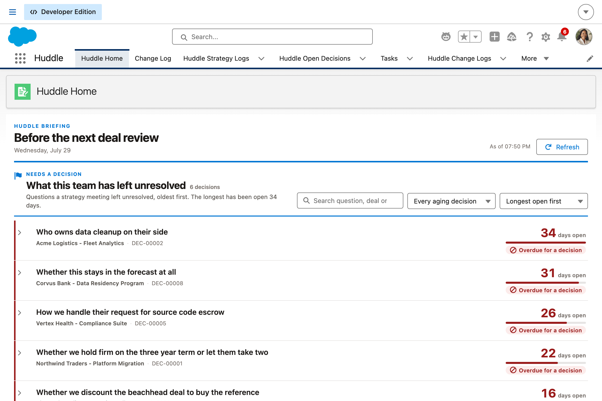
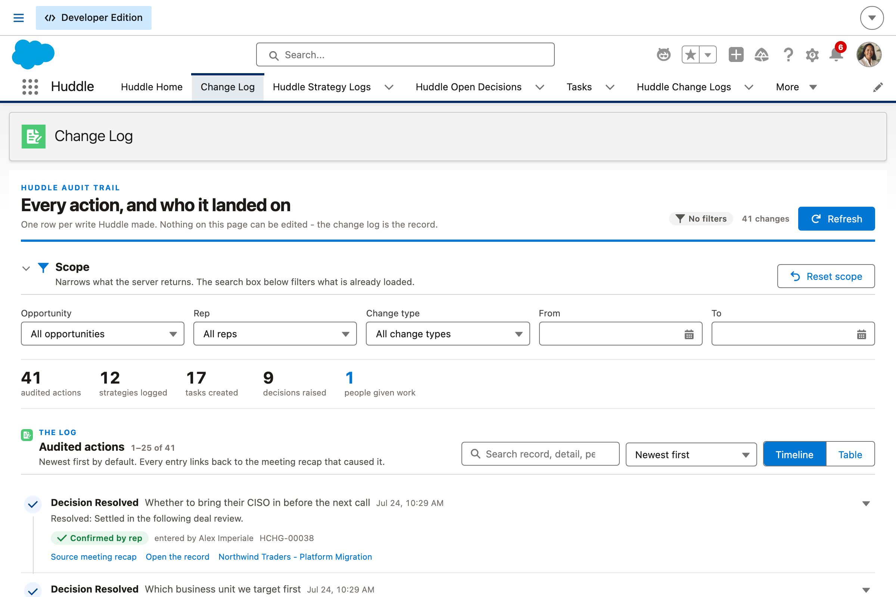
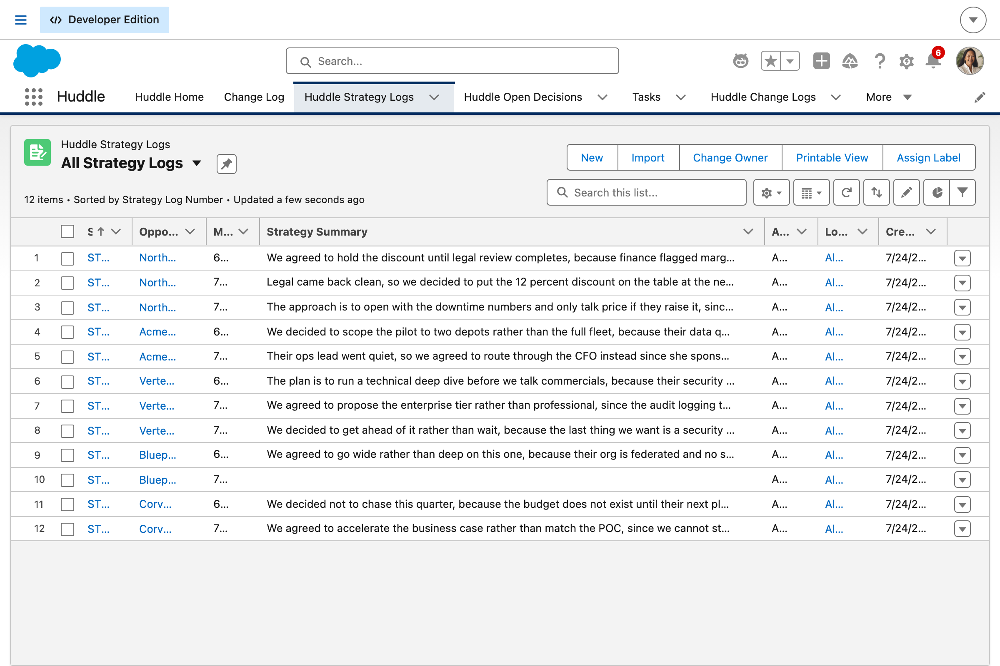
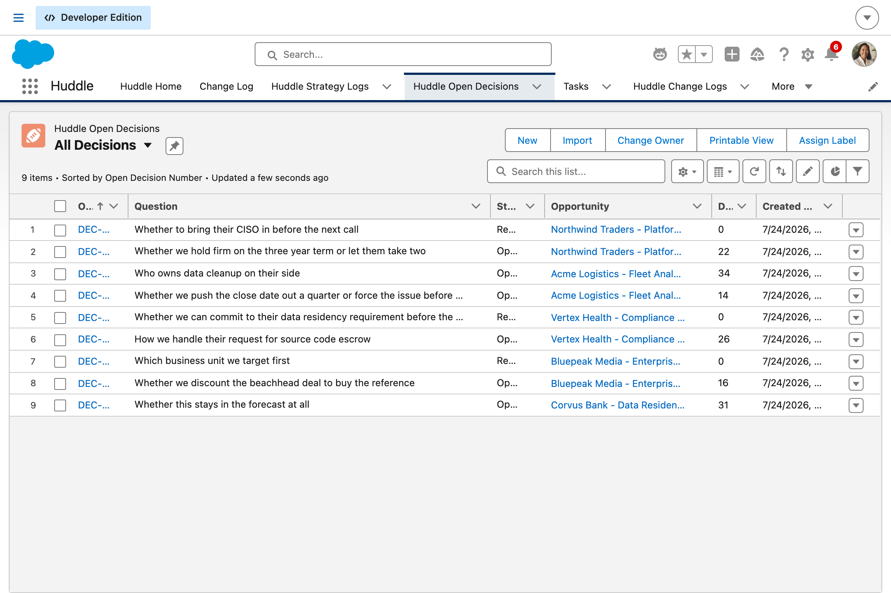

# Huddle

**Huddle is a sales employee agent that turns the notes from an internal deal-strategy meeting into real work**, action items become Tasks assigned to the right internal people, and the strategy itself gets logged against the Opportunity so the reasoning behind a deal's plan isn't lost the moment the meeting ends.

Where [Scribe](https://github.com/aleximperiale-sys/scribe) handles the customer-facing side of a deal (what was said on a call with the prospect), Huddle handles the internal side: the deal review, the strategy session with a sales engineer or manager, the "how are we going to win this" conversation that currently lives only in whoever attended's memory.

Everything Huddle logs is **internal-only at the data-model level**, and every action it takes is written to a dedicated **audit trail** reviewable through its own app, tabs, LWCs and list views.

---

## Table of contents

- [Why Huddle](#why-huddle)
- [Design goals](#design-goals)
- [The three surfaces](#the-three-surfaces)
- [Architecture and data flow](#architecture-and-data-flow)
- [The four agent topics](#the-four-agent-topics)
- [Data model](#data-model)
- [How extraction actually works](#how-extraction-actually-works)
- [Component inventory](#component-inventory)
- [Guardrails & safety](#guardrails--safety)
- [Install & deploy](#install--deploy)
- [Testing](#testing)
- [Project structure](#project-structure)
- [License](#license)

---

## Why Huddle

Internal strategy conversations are some of the most valuable and least documented moments in a sales cycle. A rep, manager and sales engineer get in a room, work out a plan, who to loop in, what objection to prepare for, what the real timeline pressure is, and then that plan evaporates the moment the meeting ends unless someone manually writes it up and manually creates every follow-up task.

In practice that rarely happens consistently, which means:

- **Action items get forgotten** because they were only ever spoken out loud.
- **The reasoning behind a strategy isn't visible** to anyone who joins later, a new AE inheriting the account, a manager doing a pipeline review.
- **The same ground gets re-litigated** in a follow-up meeting because nobody wrote down what was already decided.

Huddle's job is to make the strategy meeting itself produce the documentation and task assignments as a byproduct, instead of requiring a separate write-up step nobody has time for.

## Design goals

| Goal                                       | How Huddle honors it                                                                                                                                                                                                                                                                                                                                                                                  |
| ------------------------------------------ | ----------------------------------------------------------------------------------------------------------------------------------------------------------------------------------------------------------------------------------------------------------------------------------------------------------------------------------------------------------------------------------------------------- |
| **Never invent action items or ownership** | A sentence only becomes an action item when it carries both an actionable verb _and_ a specific owner: a named person, a named role, or explicit first person singular. "We agreed to hold the discount" is a team decision with no individual owner, so it stays in the strategy summary and never becomes somebody's task. A name that came up in another context never makes that person an owner. |
| **Confirm before assigning across people** | `Create Action Items` is two-phase. `apply=false` returns the full numbered who-gets-what preview and writes nothing; `apply=true` runs only after the attendee confirms, and carries `require_user_confirmation`. Corrections go back in as `ownerOverrides`; rejected items go in as `skipItems`.                                                                                                   |
| **One set of notes, two outputs**          | The recap is parsed **once** by _Log Strategy_ and cached on `Huddle_Strategy_Log__c.Extraction_JSON__c`. Every other topic reuses that single parse via the strategy log id, no re-pasting, no inconsistent re-parsing.                                                                                                                                                                              |
| **Preserve reasoning, not just outcomes**  | Reasoning-bearing sentences are extracted into their own field (`Decision_Reasoning__c`), separate from the decision. "We're holding the discount" without "because finance flagged margin risk" is the half a new AE can't use, and it's what makes the same debate happen twice.                                                                                                                    |
| **Internal strategy stays internal**       | Strategy logs live on a dedicated object, not a shared Note or Activity, so nothing reading Opportunity activity history, including a customer-facing agent, can pick them up. `Internal_Only__c` is asserted on the record, not by convention.                                                                                                                                                       |
| **Full transparency**                      | Every write funnels through `Huddle_ChangeLogService` and produces a `Huddle_Change_Log__c` row, with **who it was assigned to** as a first-class column and a link back to the meeting recap that caused it.                                                                                                                                                                                         |

## The three surfaces

1. **The employee agent (conversational)**, `Huddle_Agent`, an Agentforce `AiAuthoringBundle` with four working topics plus a router and an off-topic handler. Internal-facing only, no MIAW or Experience Cloud deployment, since this is purely an internal sales tool.
2. **The automation engine (headless)**, four autolaunched Flows, each wrapping an invocable Apex action that performs the write _and_ logs the audit row as its final step.
3. **The Huddle app (review & audit)**, a Lightning app where managers and deal teams see every strategy session logged, every action item assigned, and every decision still unresolved across the team's pipeline.

## Architecture and data flow

```
Attendee recap ──▶ Huddle agent (Agentforce)
                        │
                        ▼
        Huddle_ExtractionService ── one structured parse ──▶ cached on Huddle_Strategy_Log__c
                        │
      ┌─────────────────┼──────────────────┬─────────────────────┐
      ▼                 ▼                  ▼                     ▼
 Log Strategy    Create Action Items   Identify Open      Deal Team Digest
      │           (preview → confirm)    Decisions              │
      │                 │                  │                    │
      │                 ▼                  │                    │
      │          Huddle_OwnerResolver      │                    │
      │          (resolve, or admit        │                    │
      │           it can't)                │                    │
      ▼                 ▼                  ▼                    ▼
 Strategy_Log__c     Task(s)        Open_Decision__c      (read-only)
      │                 │                  │                    │
      └─────────────────┴──────────────────┴────────────────────┘
                                 │
                                 ▼
                      Huddle_Change_Log__c  ← every action, no exceptions
```

## The four agent topics

### 1. Log Strategy

Takes the meeting recap and logs the strategy and the reasoning behind it against the Opportunity as an internal note, clearly separated from customer-facing activity history. Purely additive and assigns nothing to anybody, so it runs without a confirmation gate. This is the entry point: it produces the single extraction every other topic reuses.

### 2. Create Action Items

Extracts every action item, along with who it's for and any deadline, and creates a Task per item. Because these Tasks are usually assigned to someone other than the person entering the notes, this topic **always** previews before writing:

```
1. "Priya will put together the security questionnaire response by Friday" → Priya Raman, due 3 Aug
2. "Dan Ortiz needs to reach out to their VP of Ops next week" → Dan Ortiz, due 7 Aug
3. "The sales engineer will build the demo environment next week" → unassigned (parked with you), due 7 Aug
   [OWNER UNCLEAR: the recap named a role ("Sales Engineer") rather than a person]
```

Only after the attendee says yes does the second action run with `apply=true`.

### 3. Identify Open Decisions

Flags anything the meeting explicitly left unresolved ("we still need to decide X before the next call") as a distinct, trackable `Huddle_Open_Decision__c` rather than letting an open question quietly disappear into the general notes. Deduplicates against questions already open on the same deal, so re-running on the same recap doesn't pile up copies.

### 4. Deal Team Digest

On request, summarizes the most recent strategy, **its reasoning**, the open action items with owners, and the unresolved questions, for anyone joining the deal later. Needs only an Opportunity id, no recap. Read-only against the deal, but still writes an audit row, because the guardrail is that _every_ Huddle action produces one, without exceptions carved out for the convenient cases.

## Data model

### `Huddle_Strategy_Log__c`

The raw meeting recap plus the extracted strategy, linked to the Opportunity and explicitly flagged internal-only.

| Field                                                                  | Purpose                                                                          |
| ---------------------------------------------------------------------- | -------------------------------------------------------------------------------- |
| `Meeting_Recap__c`                                                     | The recap verbatim, so every extracted item traces to the words that produced it |
| `Strategy_Summary__c`                                                  | What the team decided to do                                                      |
| `Decision_Reasoning__c`                                                | **Why** they decided it, the part that survives a handoff                        |
| `Internal_Only__c`                                                     | Always true; internal status asserted at the data-model level                    |
| `Extraction_JSON__c`                                                   | The single cached parse every downstream topic reads                             |
| `Low_Confidence__c`                                                    | Set when the recap was too thin to extract confidently                           |
| `Attendees__c`, `Meeting_Date__c`, `Logged_By__c`, `Source_Channel__c` | Meeting context                                                                  |

### `Huddle_Open_Decision__c`

An unresolved question, linked to the Opportunity and to the strategy log that raised it.

| Field          | Purpose                                                           |
| -------------- | ----------------------------------------------------------------- |
| `Question__c`  | The question, lead-in stripped so it reads as the question itself |
| `Context__c`   | The surrounding sentence: what it blocks, what would settle it    |
| `Status__c`    | Open / Resolved, so it can't stay implicit                        |
| `Needed_By__c` | Deadline the meeting attached, left blank rather than guessed     |
| `Days_Open__c` | Formula driving the aging list view and dashboard rollup          |

### `Huddle_Change_Log__c`

One record per action Huddle takes.

| Field                                                                       | Purpose                                                                                 |
| --------------------------------------------------------------------------- | --------------------------------------------------------------------------------------- |
| `Change_Type__c`                                                            | Strategy Logged / Task Created / Decision Raised / Decision Resolved / Digest Generated |
| `Assigned_To__c`                                                            | **Who the work landed on**, first-class because cross-person assignment is the risk     |
| `Source_Strategy_Log__c`                                                    | Traces every change back to the meeting recap that caused it                            |
| `Rep_Confirmed__c`                                                          | True when the attendee explicitly approved before the write                             |
| `Related_Record_Id__c`, `Object_API_Name__c`, `Opportunity__c`, `Detail__c` | What changed, where                                                                     |

### Activity extensions

`Huddle_Generated__c`, `Huddle_Source_Strategy_Log__c`, `Huddle_Owner_Unclear__c`, so Huddle's action items stay separable from a rep's own tasks and ambiguity is visible on the record.

These are defined on **`Activity`**, not `Task`. Salesforce requires custom activity fields to be created on the shared `Activity` object; they then surface on `Task` (and `Event`), which is why the Apex reads `Task.Huddle_Generated__c` while the metadata and field-level security live under `objects/Activity/`.

## How extraction actually works

`Huddle_ExtractionService` is the only place recap text is interpreted, which is what keeps the strategy log, the action items and the open decisions agreeing with each other. It classifies each sentence in a fixed order:

1. **Open questions first.** "We still need to decide whether to send the revised quote" contains the verb _send_, but nobody committed to anything, so it must not become a task.
2. **Then action items**, which need an actionable verb **and** a specific owner. This is the rule that stops group decisions turning into phantom assignments.
3. **Then reasoning and decisions**, which can co-occur in one sentence and are captured into separate fields.

`Huddle_OwnerResolver` then maps owner hints to real users, and is **deliberately willing to fail**. A hint that matches nobody, matches several people, or is only a role comes back unresolved with a reason:

| Hint                                   | Outcome                                         |
| -------------------------------------- | ----------------------------------------------- |
| `"me"` (from "I'll draft the MAP")     | Resolves to the note-taker                      |
| `"Dan Ortiz"` matching one active user | Resolves                                        |
| `"Priya"` matching three active users  | **Unresolved**, ambiguous, names the candidates |
| `"Sales Engineer"`                     | **Unresolved**, a role is not a person          |
| `"Zzyzxqvist"` matching nobody         | **Unresolved**, no active user matches          |

Anything unresolved becomes a Task flagged `Huddle_Owner_Unclear__c`, parked with the note-taker, with the reason written into the Task description. Huddle never picks a plausible-looking user to make the unresolved count zero.

## Component inventory

**Custom objects** - `Huddle_Strategy_Log__c`, `Huddle_Open_Decision__c`, `Huddle_Change_Log__c`, plus three custom fields on `Activity` (which surface on `Task`).

**Apex** (16 classes)

| Class                                   | Role                                                       |
| --------------------------------------- | ---------------------------------------------------------- |
| `Huddle_ExtractionService`              | The extraction/classification engine                       |
| `Huddle_MeetingParse`                   | The single structured parse, JSON-serializable for caching |
| `Huddle_OwnerResolver`                  | Owner hint → User, or an honest failure                    |
| `Huddle_ChangeLogService`               | The audit backbone every write funnels through             |
| `Huddle_LogStrategyInvocable`           | Topic 1                                                    |
| `Huddle_CreateActionItemsInvocable`     | Topic 2, two-phase preview/apply                           |
| `Huddle_IdentifyOpenDecisionsInvocable` | Topic 3                                                    |
| `Huddle_DealTeamDigestInvocable`        | Topic 4                                                    |
| `Huddle_ChangeLogConsoleController`     | Console + badge controller (read-only)                     |
| `Huddle_HomeDashboardController`        | Dashboard rollups (read-only)                              |
| `Huddle_Constants`, `Huddle_Util`       | Shared vocabulary and coercions                            |
| `Huddle_TestUtil` + 3 test classes      | Fixtures and coverage                                      |

**Flows** (autolaunched, referenced by the agent) - `Huddle_Log_Strategy`, `Huddle_Create_Action_Items`, `Huddle_Identify_Open_Decisions`, `Huddle_Deal_Team_Digest`.

**LWCs**

- `huddleChangeLogConsole` - filterable by Opportunity, rep and change type; each row links back to the source meeting recap.
- `huddleHomeDashboard` - sessions this week, action items completed/created, unresolved decisions, action items with an unclear owner (red when non-zero), plus open decisions aging past a week and a 7-day trend.
- `huddleOpportunityStrategyBadge` - "Huddle has logged 2 strategy sessions and 4 action items" on the Opportunity record page, with the internal-only status stated out loud and a click-through to the full history.

**Lightning app** - `Huddle`, with tabs: Huddle Home, Change Log, Strategy Logs, Open Decisions, Action Items (Tasks), Change Log records.

**Record pages** - a Lightning record page per custom object (`Huddle_Strategy_Log_Record_Page`, `Huddle_Open_Decision_Record_Page`, `Huddle_Change_Log_Record_Page`), each assigned as the object's org default desktop page via `actionOverrides` on the object, with a compact layout driving the highlights panel and a page layout ordering fields by decision-relevance rather than alphabetically. The strategy log is the hub: it carries related lists for its open decisions, its generated action items and its audit rows. Plus `Huddle_Opportunity_Record_Page`, which surfaces `huddleOpportunityStrategyBadge` on the deal.

**List views** - Task: _Created by Huddle_, _Huddle: Owner Unclear_. Open Decision: _Open_, _Aging Past 7 Days_, _All_. Strategy Log: _This Week_, _By Opportunity_.

**Permission sets** - `Huddle_Agent_User` (write to Task, Strategy Log, Open Decision, Change Log; Opportunity deliberately **read-only**, Huddle logs strategy against a deal but never edits the deal's own fields) and `Huddle_Reviewer` (read access for managers, plus the ability to resolve an open decision).

## Guardrails & safety

- **Every write produces a change-log row.** Not optional, not configurable. A manager reviewing the app can always see exactly what was logged and assigned.
- **Cross-person assignment requires confirmation every time.** Assigning work to someone who wasn't the one entering the notes carries real risk of misattribution if the extraction gets it wrong, so the assignment list is always shown first and `require_user_confirmation` is set on the applying action.
- **Ambiguity is surfaced, never resolved by guessing.** No owner Huddle can resolve means a Task flagged "owner unclear" parked with the note-taker, with the reason on the record, and its own list view and dashboard tile so it doesn't sit unnoticed.
- **Internal-only at the data model.** A dedicated object, not a shared Note or Activity that another tool or customer-facing agent might read from.
- **The agent is deployed internal-facing only.** `AgentforceEmployeeAgent`, no MIAW or Experience Cloud surface, since there's no external or partner-facing use case.

## Install & deploy

Requires the Salesforce CLI and an org with Agentforce enabled.

```bash
git clone https://github.com/aleximperiale-sys/huddle.git
cd huddle
npm install

sf org login web --alias huddle-dev
sf project deploy start --target-org huddle-dev

sf org assign permset --name Huddle_Agent_User --target-org huddle-dev
sf org assign permset --name Huddle_Reviewer --target-org huddle-dev
```

Then, in the org:

1. Open **Setup → Agentforce Agents** and activate `Huddle`.
2. Open the **Huddle** app to see the dashboard and change log.

`huddleOpportunityStrategyBadge` no longer needs to be placed by hand: `Huddle_Opportunity_Record_Page` ships it on the Opportunity sidebar and is assigned as the org's default desktop Opportunity page by `objects/Opportunity/Opportunity.object-meta.xml`. **That replaces whatever Opportunity record page the target org is using today.** Delete that one file before deploying to keep the org's existing page; the flexipage still deploys and can be activated by hand from Setup → Object Manager → Opportunity → Lightning Record Pages.

## Testing

```bash
npm run lint            # ESLint over the LWCs
npm run prettier:verify # formatting (XML is excluded, see below)
sf apex run test --target-org huddle-dev --code-coverage --result-format human
```

Last verified run: **35 tests, 100% pass rate**, per-class coverage 80–100%.

The Apex tests concentrate on the negative cases, since those are what the design goals actually assert:

- a decision with no named owner produces **zero** action items
- an unresolved question is **not** also filed as an action item
- `apply=false` creates **no** Tasks and **no** audit rows
- an unresolvable or role-only owner is **flagged**, not guessed
- a thin recap sets `lowConfidence` instead of producing confident nonsense

> **Note on formatting:** `**/*.xml` is in `.prettierignore`. The Prettier XML plugin reflows text nodes inside elements whose content must be an exact API name (`<flow>`, `<apexClass>`), which corrupts the metadata. Apex, JS, HTML and CSS are Prettier-formatted normally.

## Project structure

```
force-app/main/default/
├── aiAuthoringBundles/Huddle_Agent/   # the Agentforce agent
├── applications/                      # the Huddle Lightning app
├── classes/                           # 16 Apex classes
├── flexipages/                        # Huddle Home, Change Log + 4 record pages
├── flows/                             # 4 autolaunched flows
├── layouts/                           # field order + related lists per custom object
├── lwc/                               # 3 components
├── objects/                           # 3 custom objects + Activity fields + list views
│                                      #   + compact layouts + record page assignment
├── permissionsets/                    # Huddle_Agent_User, Huddle_Reviewer
└── tabs/                              # 5 tabs
```

## Screenshots

Captured from a live org at a 1200px viewport.

| | |
|---|---|
|  |  |
| **Huddle Home.** The briefing sheet. Open decisions aging past a week lead the page, because that is the region a manager acts on. | **Change Log.** Every write Huddle made, with scope filters, search, sorting and paging. |
|  |  |
| **Strategy Logs.** All Strategy Logs, the tab default. | **Open Decisions.** All Decisions, with day count and urgency. |

## License

See [LICENSE](LICENSE).
